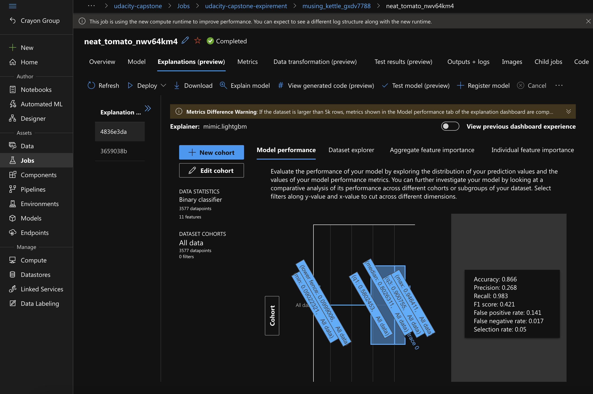

# Udacity Azure ML Capstone Project 🌟


This is the last project in the Azure ML Engineer path. We want build heart stroke predictor by using dataset from Kaggle. We will predict based on different diseases and habits.

We will build AutoML model and a custom made model with HyperDrive. We will choose the best model to deploy and send scoring requests.

## Project Set Up and Installation
*OPTIONAL:* If your project has any special installation steps, this is where you should put it. To turn this project into a professional portfolio project, you are encouraged to explain how to set up this project in AzureML.

📐 Setup:

* Azure Machine Learning Workspace with Python SDK
* Notebooks named `automl` and `hyperparameter_tuning`
* Python script `train.py`
* conda environment yaml file `conda_env.yml` 
* Scoring script `score.py`

🏃 Run:

- Upload files to a jupyter notebook
- Run all cells in `automl` notebook until `Model Deployment` section
- Run all the cells in `hyperparameter_tuning` until `Model Deployment` section
- Compare the best model in both based on accuracy, then run `Model Deployment` from the notebook corresponding to the ***best*** performing model !

## Dataset

### Overview
*TODO*: Explain about the data you are using and where you got it from.

We will use data from `healthcare-dataset-stroke-data.csv` downloaded from [Kaggle](https://www.kaggle.com/fedesoriano/stroke-prediction-dataset). The data a table of stroke events, which is the one of the leading causes of death globally according to the World Health Organization (WHO). These are the column descriptions according to Kaggle:

1. id: unique identifier
2. gender: "Male", "Female" or "Other"
3. age: age of the patient
4. hypertension: 0 if the patient doesn't have hypertension, 1 if the patient has hypertension
5. heart_disease: 0 if the patient doesn't have any heart diseases, 1 if the patient has a heart disease
6. ever_married: "No" or "Yes"
7. work_type: "children", "Govt_jov", "Never_worked", "Private" or "Self-employed"
8. Residence_type: "Rural" or "Urban"
9. avg_glucose_level: average glucose level in blood
10. bmi: body mass index
11. smoking_status: "formerly smoked", "never smoked", "smokes" or "Unknown"*
12. stroke: 1 if the patient had a stroke or 0 if not *Note: "Unknown" in smoking_status means that the information is unavailable for this patient

We will normalize the following columns:

1. work_type: Private to 1, Self-employed to 0, others -1
2. bmi: N/A to 0
3. gender: Female to 0, Male to 1
4. smoking_status: smokes to 1, never smoked to -1, formerly smoked to 2, 
5. Residence_type: Urban to 1, Rural to 0others to 0


### Task
*TODO*: Explain the task you are going to be solving with this dataset and the features you will be using for it.

We will train a **predictor** to predict if a stroke **going to happen** " GodForbid " or **not**. Our data contain several people with various diseases and habits, and these for sure are having a correlation. We are going to find the best model from AutoML or HyperDriveParameter.

### Access
*TODO*: Explain how you are accessing the data in your workspace.


The dataset is free and it can be downloade from [Kaggle](https://www.kaggle.com/fedesoriano/stroke-prediction-dataset), but I downloaded it and saved it into my Github repo and used it in Azure ML.

I loaded the dataset and register it inside my workspace using the code below:


The dataset after registeration into the workspace looks like this:


## Automated ML
*TODO*: Give an overview of the `automl` settings and configuration you used for this experiment

We used `AUC_weighted` metric seems the one we got the best result with. For the training as mentioned above, we use:

- n_cross_validations = 2 ( cross validation number to execute )

  - We used this value to perform k-fold cross-validation, This parameter sets how many cross validations to perform, based on the same number of folds. In the following code, two folds for cross-validation are defined. Hence, two different trainings, each training using 1/2 of the data, and each validation using 1/2 of the data with a different holdout fold each time.

- experiment_timeout_minutes = 30 ( max experiment timeout period )

  - Seems a reasonable timeout period specially when choosing a fast compute clusters

- primary_metric = AUC_weighted ( arithmetic mean of the score for each class, weighted by the number of true instances in each class )

  - We used `AUC_weighted` metric seems the one we got the best result more than the other different metrics.

    


```python
automl_settings = {
    "n_cross_validations": 2,
    "experiment_timeout_minutes": 30,
    "max_concurrent_iterations": 5,
    "primary_metric" : 'AUC_weighted',
    "verbosity": logging.INFO,
}

automl_config = AutoMLConfig(compute_target=compute_target,
                             task = "classification",
                             training_data=training_data,
                             label_column_name="stroke",   
                             path = './udacity-capstone-project',
                             enable_early_stopping= True,
                             featurization= 'auto',
                             debug_log = "automl_errors.log",
                             **automl_settings
                            )
```


### Results
*TODO*: What are the results you got with your automated ML model? What were the parameters of the model? How could you have improved it?

Increasing cross-correlation and experiment timeout can help improving it.

*TODO* Remeber to provide screenshots of the `RunDetails` widget as well as a screenshot of the best model trained with it's parameters.


The following are the estimators related to the best model:

```python
Run(Experiment: udacity-capstone-expirement,
Id: AutoML_f99037f5-27fd-4dbb-81ce-60b79bbda306_38,
Type: azureml.scriptrun,
Status: Completed)
[('4', Pipeline(memory=None,
         steps=[('standardscalerwrapper',
                 StandardScalerWrapper(copy=True, with_mean=False, with_std=True)),
                ('lightgbmclassifier',
                 LightGBMClassifier(boosting_type='gbdt', colsample_bytree=0.4955555555555555, learning_rate=0.09473736842105263, max_bin=140, max_depth=6, min_child_weight=0, min_data_in_leaf=0.08276034482758622, min_split_gain=0.10526315789473684, n_estimators=25, n_jobs=1, num_leaves=164, problem_info=ProblemInfo(gpu_training_param_dict={'processing_unit_type': 'cpu'}), random_state=None, reg_alpha=0.3157894736842105, reg_lambda=0.3157894736842105, subsample=0.5942105263157895))],
         verbose=False)), ('34', Pipeline(memory=None,
         steps=[('standardscalerwrapper',
                 StandardScalerWrapper(copy=True, with_mean=False, with_std=True)),
                ('lightgbmclassifier',
                 LightGBMClassifier(boosting_type='gbdt', colsample_bytree=0.1988888888888889, learning_rate=0.026323157894736843, max_bin=220, max_depth=3, min_child_weight=9, min_data_in_leaf=0.08276034482758622, min_split_gain=0.42105263157894735, n_estimators=600, n_jobs=1, num_leaves=2, problem_info=ProblemInfo(gpu_training_param_dict={'processing_unit_type': 'cpu'}), random_state=None, reg_alpha=0.9473684210526315, reg_lambda=0.42105263157894735, subsample=0.7426315789473684))],
         verbose=False)), ('18', Pipeline(memory=None,
         steps=[('standardscalerwrapper',
                 StandardScalerWrapper(copy=True, with_mean=False, with_std=False)),
                ('xgboostclassifier',
                 XGBoostClassifier(booster='gbtree', colsample_bytree=1, eta=0.3, gamma=0, max_depth=8, max_leaves=255, n_estimators=10, n_jobs=1, objective='reg:logistic', problem_info=ProblemInfo(gpu_training_param_dict={'processing_unit_type': 'cpu'}), random_state=0, reg_alpha=0.8333333333333334, reg_lambda=1.9791666666666667, subsample=0.8, tree_method='auto'))],
         verbose=False)), ('30', Pipeline(memory=None,
         steps=[('standardscalerwrapper',
                 StandardScalerWrapper(copy=True, with_mean=False, with_std=True)),
                ('lightgbmclassifier',
                 LightGBMClassifier(boosting_type='goss', colsample_bytree=0.1988888888888889, learning_rate=0.0842121052631579, max_bin=140, max_depth=7, min_child_weight=3, min_data_in_leaf=0.08965620689655174, min_split_gain=0.631578947368421, n_estimators=200, n_jobs=1, num_leaves=242, problem_info=ProblemInfo(gpu_training_param_dict={'processing_unit_type': 'cpu'}), random_state=None, reg_alpha=0.47368421052631576, reg_lambda=0.631578947368421, subsample=1))],
         verbose=False)), ('32', Pipeline(memory=None,
         steps=[('standardscalerwrapper',
                 StandardScalerWrapper(copy=True, with_mean=False, with_std=True)),
                ('logisticregression',
                 LogisticRegression(C=0.02811768697974228, class_weight=None,
                                    dual=False, fit_intercept=True,
                                    intercept_scaling=1, l1_ratio=None,
                                    max_iter=100, multi_class='ovr', n_jobs=1,
                                    penalty='l2', random_state=None,
                                    solver='saga', tol=0.0001, verbose=0,
                                    warm_start=False))],
         verbose=False)), ('33', Pipeline(memory=None,
         steps=[('standardscalerwrapper',
                 StandardScalerWrapper(copy=True, with_mean=False, with_std=True)),
                ('logisticregression',
                 LogisticRegression(C=0.019306977288832496, class_weight=None,
                                    dual=False, fit_intercept=True,
                                    intercept_scaling=1, l1_ratio=None,
                                    max_iter=100, multi_class='ovr', n_jobs=1,
                                    penalty='l2', random_state=None,
                                    solver='saga', tol=0.0001, verbose=0,
                                    warm_start=False))],
         verbose=False)), ('27', Pipeline(memory=None,
         steps=[('standardscalerwrapper',
                 StandardScalerWrapper(copy=True, with_mean=False, with_std=False)),
                ('xgboostclassifier',
                 XGBoostClassifier(booster='gbtree', colsample_bytree=1, eta=0.01, max_depth=3, max_leaves=0, n_estimators=50, n_jobs=1, objective='reg:logistic', problem_info=ProblemInfo(gpu_training_param_dict={'processing_unit_type': 'cpu'}), random_state=0, reg_alpha=0, reg_lambda=2.0833333333333335, subsample=0.6, tree_method='auto'))],
         verbose=False)), ('17', Pipeline(memory=None,
         steps=[('standardscalerwrapper',
                 StandardScalerWrapper(copy=True, with_mean=False, with_std=True)),
                ('extratreesclassifier',
                 ExtraTreesClassifier(bootstrap=False, ccp_alpha=0.0,
                                      class_weight='balanced', criterion='gini',
                                      max_depth=None, max_features=None,
                                      max_leaf_nodes=None, max_samples=None,
                                      min_impurity_decrease=0.0,
                                      min_impurity_split=None,
                                      min_samples_leaf=0.01,
                                      min_samples_split=0.056842105263157895,
                                      min_weight_fraction_leaf=0.0,
                                      n_estimators=200, n_jobs=1,
                                      oob_score=False, random_state=None,
                                      verbose=0, warm_start=False))],
         verbose=False)), ('28', Pipeline(memory=None,
         steps=[('standardscalerwrapper',
                 StandardScalerWrapper(copy=True, with_mean=False, with_std=False)),
                ('xgboostclassifier',
                 XGBoostClassifier(booster='gbtree', colsample_bytree=1, eta=0.3, gamma=0, grow_policy='lossguide', max_bin=255, max_depth=8, max_leaves=31, n_estimators=100, n_jobs=1, objective='reg:logistic', problem_info=ProblemInfo(gpu_training_param_dict={'processing_unit_type': 'cpu'}), random_state=0, reg_alpha=0.625, reg_lambda=1.9791666666666667, subsample=0.7, tree_method='hist'))],
         verbose=False)), ('7', Pipeline(memory=None,
         steps=[('standardscalerwrapper',
                 StandardScalerWrapper(copy=True, with_mean=False, with_std=False)),
                ('xgboostclassifier',
                 XGBoostClassifier(booster='gbtree', colsample_bytree=0.5, eta=0.3, gamma=0, max_depth=10, max_leaves=255, n_estimators=10, n_jobs=1, objective='reg:logistic', problem_info=ProblemInfo(gpu_training_param_dict={'processing_unit_type': 'cpu'}), random_state=0, reg_alpha=0, reg_lambda=0.10416666666666667, subsample=0.7, tree_method='auto'))],
         verbose=False))]
```

The best automl pipeline:




## Hyperparameter Tuning

*TODO*: What kind of model did you choose for this experiment and why? Give an overview of the types of parameters and their ranges used for the hyperparameter search

Hyperdrive parameters are:

- Regulation C: Regularization to avoid overfitting so that we get more accurate generalized predictions
- Max iteration: Maximum number of iterations to converge (50,100,150,200,250)


### Results
*TODO*: What are the results you got with your model? What were the parameters of the model? How could you have improved it?

We will `Accuracy` metric and goal to MAXIMIZE and we got an accuracy of ~95.7%. These are the parametrs of the best model:


*TODO* Remeber to provide screenshots of the `RunDetails` widget as well as a screenshot of the best model trained with it's parameters.


## Model Deployment
*TODO*: Give an overview of the deployed model and instructions on how to query the endpoint with a sample input.

We deployed the best model which is the hyperdrive model, (with ApplicationInsight - no authentication which is not recommended in a production environment)


Consumption


## Screen Recording

*TODO* Provide a link to a screen recording of the project in action. Remember that the screencast should demonstrate:
- A working model
- Demo of the deployed  model
- Demo of a sample request sent to the endpoint and its response

​	https://www.youtube.com/watch?v=b6_Hy4VZWDQ

## Standout Suggestions
*TODO (Optional):* This is where you can provide information about any standout suggestions that you have attempted.

We can increase the number of the iterations to have a better model, also more data will help a lot.
